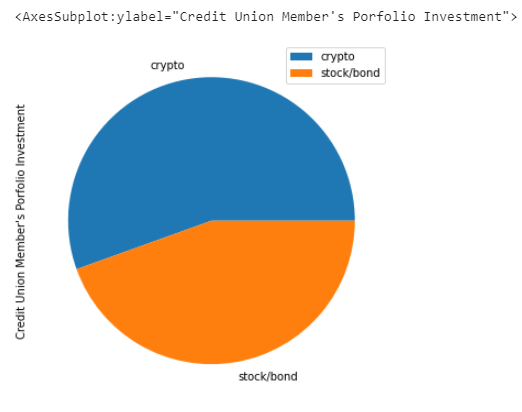
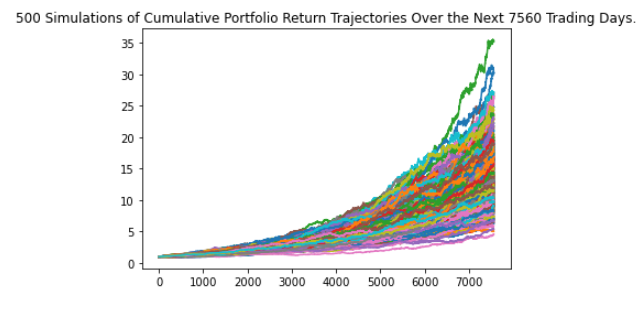
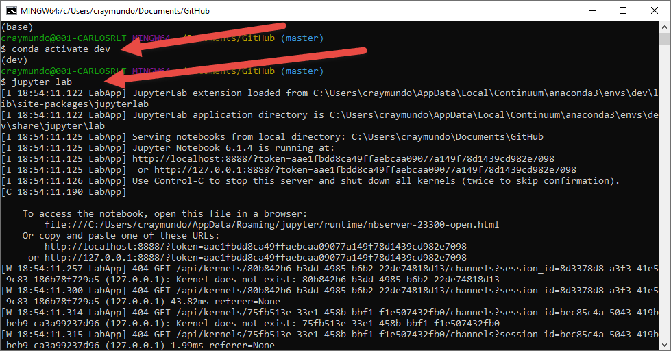

# Financial Planner For Retirement

This is a single Jupiter Notebook that uses MCForecastTools.py module to forecast a credit union member portfolio's return for 30-year siding more investing on bonds vs stocks and a 10-year approach leaning to invest more on stocks vs bonds. The notebook is configured to retrieve data from using Alpaca API and the concatenate the DataFrames by using MonteCarlo Simulation.

---


## Technologies

This project leverages python 3.7 with the following packages:

* [Pandas](https://pandas.pydata.org/docs/user_guide/visualization.html) - For the command line interface, help page, and entrypoint.

* [JupyterLab](http://jupyterlab.io/) - For interactive user workspace that utilizes Notebook.

* [Numpy](https://numpy.org/doc/stable/reference/generated/numpy.sqrt.html) - NumPy sqrt function. Return the non-negative square-root of an array, element-wise. The values whose square-roots are required.

* [matplotlib](https://matplotlib.org/) - a cross-platform, data visualization and graphical plotting library for Python and its numerical extension NumPy. 

* [Alpaca](https://alpaca.markets/) - sign up and register.


---

## Installation Guide

Before running the application first install the following dependencies.


* [Git Bash (Windows) or Terminal (macOS)] (https://git-scm.com/downloads) -  
* [Anaconda with Python 3.7] (https://docs.anaconda.com/anaconda/install/) - 

* [installing the Requests library] (conda install -c anaconda requests)

* [installing the JSON library] (conda install -c jmcmurray json)
* [installing python-dotenv Library] (pip install python-dotenv)
* [install alpaca SDK] 
    - pip install alpaca-trade-api
    - conda list python-dotenv
    - conda list alpaca-trade-api

--- 

You’ll use environment (.env) files to protect your Quandl and Alpaca API keys. When you create an environment file, the system hides it in the folder structure of the project. 
Windows Users: Display Your Hidden Files in File Explorer
To display the hidden files on a Windows computer, complete the following steps:

In the search bar, type “folder”.

Click “File Explorer Options”.

In the “File Explorer Options” dialog box that displays, click the View tab. Select “Show hidden files, folders, and drives,” and then click OK, as the following image shows:

---

## Examples

This section includes screenshots of few plots that can easyly be obtain by running this notebook.

- Plotting a pie chart illustrating a credit union portfolio.

- Plotting a chart illustrating the trajectory of 500 MonteCarlo simulations.

- Plotting a distribution chart based on a MonteCarlo Simulation.


---

## Usage

To use AnalyzingPortfolioRisk-Profit book simply clone the repository and run "Git Bash" with:

```
- Start by activating an Anaconda Environment instance.
- Then follow by starting Jupyter Lab

```
Upon launching the loan qualifier application you will be greeted with the following prompts.


---

## Contributors

Brought to you by Carlos R. you may reach me at reachcarlostoday@gmail.com

---

## License

MIT.